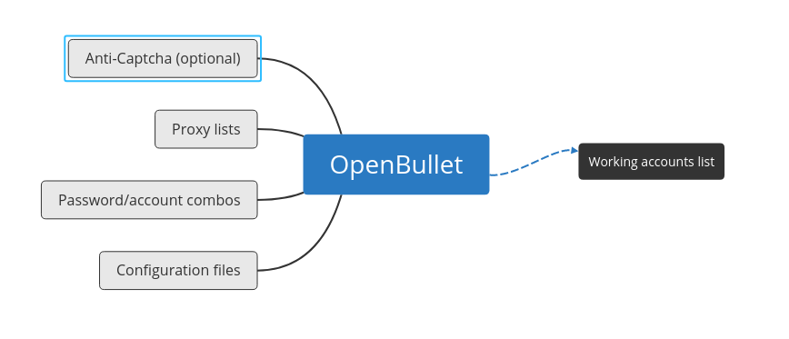

## Credential Stuffing

Credential stuffing is the use of leaked password sites to gain a list of valid username/password combinations for a target site.

Often leaked passwords come from large website breaches like the famous LinkedIn breach, but they can also come from smaller less known sites. For example a small forum site with 100,000 users when attacked *(for instance by an SQL injection attack)* may leak a list of unprotected passwords.

While the small forum might not have much of value for the attacker the account/password list provides the raw resources which can be used for a credential stuffing attack on several other sites.

**Note: Password Hasing**

A successful SQL attack can yield a list of hashed or unhashed passwords. Hashed passwords are ones which are transformed using a one-way function which transforms them into a standard sized string of scrambled charachters. The same password input run through the same hashing algorithm will always produce the same hased result.

Website developers should ensure to always encrypto passwords as it could potentially protect users from having their passwords exposed. A leaked list of account/password combinations which are hashed can require a significant amount of effort to make use. A database which saves passwords in plaintext on the other hand is very easily and quickly exploited.

What makes hasing so effective is that the algorithm is only one way. Plain-text can be put into the algorithm to produce a hash but there is no way to reverse the hash back into the password using the algorithm, even the website owners can't access these passwords.

Yet password hashing does not provide complete protection. A popular program [John the Ripper](https://github.com/magnumripper/JohnTheRipper) can be used to break password hashes given enough time. It has several modes for cracking one of the most popular being a dictionary attack. A dictionary attack involves comparing hashes in a database to a list of popular passwords in their hash formats. Of course having the same hash requires both the exact same input password and the exact same hashing algorithm. There may be many possible dictionaries to test against, but given the attacker has already obtained the database they have an essentially unlimited amount of time to make attempts at cracking.

Salting adds uniqueness to a hashed password meaning that a standard rainbow table won't be effective. A salt is essentially a random string of text which is prepended or appended to the users passwords before it goes into the hashing algorithm. 

